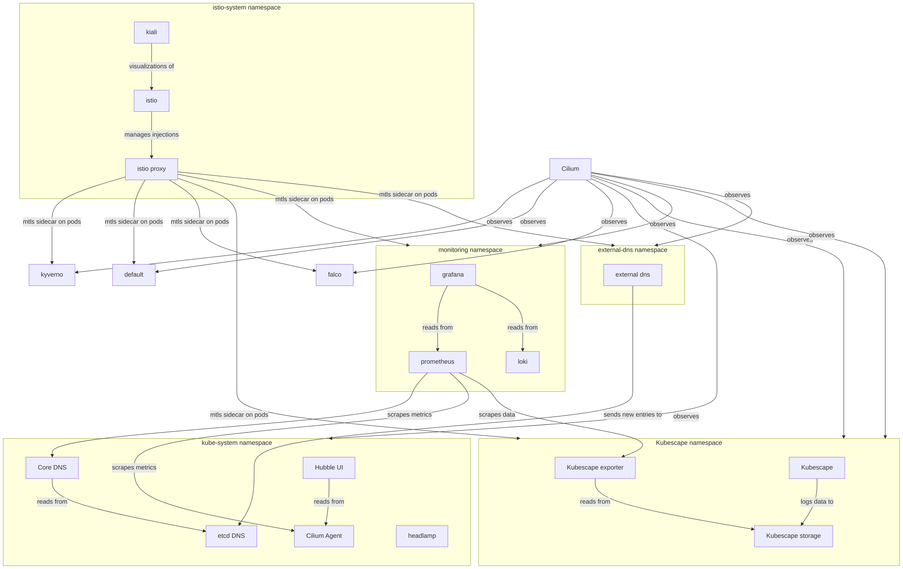

+++
title = 'Homelab'
date = 2026-08-11T09:53:39-07:00
draft = true
author = "Ceald"
authorTwitter = "" #do not include @
cover = "/kubenetes-meme-resized.png"
coverOnly = true
tags = ["new", "kubernetes","homelab", "k3s", "k8s"]
keywords = ["homelab", "kubernetes","homelab", "k3s", "k8s"]
description = "an elitist homelab guide to homelabbing"
showFullContent = false
readingTime = true
hideComments = false
summary = "an elitist homelab"
toc = true
+++

# Background
After messing with K3S for a bit I was kind of sick of dealing with the lack of resources on a PI 4 so I brought it to my laptop.


# So We Begin!


First and most important step is to pick the Kubernetes distribution for the right job, I went with K3S for because it comes with traefik but I'd use something like RKE2 or Kubeadm instead because of the customizability next time.

Second is to pick a CNI/Network plugin for Kubernetes, depending on the distribution it might already come with one or maybe you'd want to switch it out. I personally used Cilium because of its observability and Hubble UI. Without a CNI your cluster won't be able to communicate with anything inside or outside it.

Third is to pick a storage class for persistence, I went with longhorn because of the frontend for it and flexability, longhorn is also distributed/replicated rather than just being local on a node.

Fourth it'd be nice to have a frontend for managing everything. Something like either rancher or headlamp would be best. I went with headlamp because of how lightweight it is. The rest after this is optional but if you want the most Kuber Kubernetes cluster it'd be a good idea to set these up too.

## Side Note
The next services that are going to be setup is overkill for a basic homelab but this is an elitist homelab so nothing is overkill!

## Other services
Getting metrics with grafana is almost always a must so installing the kubestack is a good idea and loki. These were my values.yaml files:
```yaml
# kube-stack-values.yaml
USER-SUPPLIED VALUES:
grafana:
  additionalDataSources: []
  persistence:
    accessModes:
      - ReadWriteOnce
    enabled: true
    size: 10Gi
    storageClassName: longhorn
    type: pvc
  resources:
    # Main Grafana container
    requests:
      cpu: 100m
      memory: 128Mi
    limits:
      cpu: 500m
      memory: 512Mi
persistence:
  storageClass: longhorn

prometheus:
  prometheusSpec:
    scrapeInterval: 30s

    serviceMonitorSelectorNilUsesHelmValues: false
    serviceMonitorSelector: {}
    serviceMonitorNamespaceSelector: {}

    podMonitorSelectorNilUsesHelmValues: false
    podMonitorSelector: {}
    podMonitorNamespaceSelector: {}

    storageSpec:
      volumeClaimTemplate:
        spec:
          accessModes:
            - ReadWriteOnce
          resources:
            requests:
              storage: 50Gi
          storageClassName: longhorn

    resources:
      requests:
        cpu: 500m
        memory: 512Mi
      limits:
        cpu: 1000m
        memory: 2Gi
```
and loki:
```yaml
# loki-values.yaml
loki:
  commonConfig:
    replication_factor: 1

  auth_enabled: false

  isDefault: false

  schemaConfig:
    configs:
      - from: "2024-01-01"
        store: tsdb
        object_store: filesystem
        schema: v13
        index:
          prefix: loki_index_
          period: 24h

  storage:
    type: filesystem
    bucketNames:
      chunks: chunks
      ruler: ruler
      admin: admin

  limits_config:
    allow_structured_metadata: true

deploymentMode: SingleBinary

singleBinary:
  replicas: 1

gateway:
  enabled: false

read:
  replicas: 0

write:
  replicas: 0

backend:
  replicas: 0

querier:
  replicas: 0

queryFrontend:
  replicas: 0

queryScheduler:
  replicas: 0

ingester:
  replicas: 0
distributor:
  replicas: 0
compactor:
  replicas: 0
lokiCanary:
  enabled: false
chunksCache:
  enabled: false
resultsCache:
  enabled: false
test:
  enabled: false
monitoring:
  dashboards:
    enabled: false
  rules:
    enabled: false
  serviceMonitor:
    enabled: false

```
another thing that would be great for observability is falco! Here's my values.yaml file:
```yaml
# falco-values.yaml
json_output: true
json_include_output_property: true
http_output:
  enabled: true
  url: "http://falco-falcosidekick:2801/"
falcosidekick:
  enabled: true

  config:
    loki:
      hostport: http://loki.monitoring.svc.cluster.local:3100
      format: json
falcoctl:
  config:
    artifact:
      install:
        refs:
          - falco-rules:5
          - falco-incubating-rules:2
          - falco-sandbox-rules:2
      follow:
        refs:
          - falco-rules:5
          - falco-incubating-rules:2
          - falco-sandbox-rules:2
```

falco is a runtime security tool that detects policy violations like for example reading `/etc/shadow` and can return an error early using eBPFs.

you'll get metrics and logs exported so you can view them in grafana.

It's probably apparent that you won't be able to access anything because you don't have any ingresses setup in the cluster yet, that's where kyverno and cert manager will come into play.

Install kyverno and cert manager then create a cluster issuer and everything else for cert manager like:
```yaml
apiVersion: cert-manager.io/v1
kind: Issuer
metadata:
  name: selfsigned-issuer
  namespace: cert-manager
spec:
  selfSigned: {}
---
apiVersion: cert-manager.io/v1
kind: Certificate
metadata:
  name: orbit-ca
  namespace: cert-manager
spec:
  isCA: true
  commonName: orbit-ca
  secretName: orbit-ca-secret
  privateKey:
    algorithm: ECDSA
    size: 256
  issuerRef:
    name: selfsigned-issuer
    kind: Issuer
    group: cert-manager.io
---
apiVersion: cert-manager.io/v1
kind: ClusterIssuer
metadata:
  name: orbit-ca-cluster-issuer
spec:
  ca:
    secretName: orbit-ca-secret # adjust to match your actual CA secret
```
this issuer is cluster wide btw so you can get certs signed from this issuer anywhere.

For kyverno policy:
```yaml
apiVersion: kyverno.io/v1
kind: ClusterPolicy
metadata:
  name: force-external-dns-target
spec:
  admission: true
  background: true
  emitWarning: false
  mutateExistingOnPolicyUpdate: true
  rules:
  - match:
      any:
      - resources:
          kinds:
          - Ingress
    mutate:
      patchStrategicMerge:
        metadata:
          annotations:
            cert-manager.io/cluster-issuer: orbit-ca-issuer
            external-dns.alpha.kubernetes.io/target: 127.0.0.1
      targets:
      - apiVersion: networking.k8s.io/v1
        kind: Ingress
    name: set-target-annotation
    skipBackgroundRequests: true
  validationFailureAction: Audit
```
You don't need the external dns annotation in the policy if you're not going to use external dns but if you do it'd be a good idea to also get etcd or a source for external dns to write to.

The policy will mutate all your ingresses to have the orbit-ca-issuer added so you don't need to manually add it everytime you make an ingress.

Now for your first ingress on the cluster, you'd write something like this:
```yaml
apiVersion: networking.k8s.io/v1
kind: Ingress
metadata:
  annotations:
  name: prometheus-grafana-ingress
  namespace: monitoring
spec:
  ingressClassName: traefik
  rules:
  - host: dashboard.orbit.orbit
    http:
      paths:
      - backend:
          service:
            name: prometheus-grafana
            port:
              number: 80
        path: /
        pathType: ImplementationSpecific
  tls:
  - hosts:
    - dashboard.orbit.orbit
    secretName: grafana-tls
```
If you get that ingress like: `kubectl get ingress -n monitoring -o yaml` you'll notice that it's been changed! If not then add this cluster role:
```yaml
apiVersion: rbac.authorization.k8s.io/v1
kind: ClusterRole
metadata:
  name: kyverno-background-controller-namespace
  labels:
    rbac.kyverno.io/aggregate-to-background-controller: "true"
rules:
  - apiGroups:
      - ""
    resources:
      - namespaces
    verbs:
      - get
      - list
      - watch
      - update
      - patch
```
Nice, not even halfway done yet! I won't post ALL my ingresses because that'd be insane.


Time to get some services for security going for enforcement, security posture, and observability.


### Falco
here's my falco dashboard if you chose to use flaco:
```
{
  "apiVersion": "dashboard.grafana.app/v2",
  "kind": "Dashboard",
  "metadata": {
    "name": "falco-loki-overview",
    "namespace": "default",
    "uid": "19116f53-8e05-4028-a9c4-6144679c9ff4",
    "resourceVersion": "1786738650362008",
    "generation": 11,
    "creationTimestamp": "2026-08-14T20:05:37Z",
    "labels": {
      "grafana.app/deprecatedInternalID": "3189760802177024"
    },
    "annotations": {
      "grafana.app/createdBy": "user:efuqhwxn3paf4b",
      "grafana.app/saved-from-ui": "Grafana v13.1.2 (7f247b37a4)",
      "grafana.app/updatedBy": "user:efuqhwxn3paf4b",
      "grafana.app/updatedTimestamp": "2026-08-14T20:17:30Z"
    }
  },
  "spec": {
    "annotations": [
      {
        "kind": "AnnotationQuery",
        "spec": {
          "query": {
            "kind": "DataQuery",
            "group": "grafana",
            "version": "v0",
            "spec": {}
          },
          "enable": true,
          "hide": true,
          "iconColor": "rgba(0, 211, 255, 1)",
          "name": "Annotations & Alerts",
          "builtIn": true
        }
      }
    ],
    "cursorSync": "Crosshair",
    "editable": true,
    "elements": {
      "panel-1": {
        "kind": "Panel",
        "spec": {
          "id": 1,
          "title": "Total Detections",
          "description": "",
          "links": [],
          "data": {
            "kind": "QueryGroup",
            "spec": {
              "queries": [
                {
                  "kind": "PanelQuery",
                  "spec": {
                    "query": {
                      "kind": "DataQuery",
                      "group": "loki",
                      "version": "v0",
                      "datasource": {
                        "name": "P8E80F9AEF21F6940"
                      },
                      "spec": {
                        "direction": "backward",
                        "editorMode": "code",
                        "expr": "sum(count_over_time({app=\"falco\"}[$__interval]))",
                        "queryType": "range"
                      }
                    },
                    "refId": "A",
                    "hidden": false
                  }
                }
              ],
              "transformations": [],
              "queryOptions": {}
            }
          },
          "vizConfig": {
            "kind": "VizConfig",
            "group": "stat",
            "version": "13.1.2",
            "spec": {
              "options": {
                "colorMode": "value",
                "graphMode": "area",
                "justifyMode": "auto",
                "orientation": "auto",
                "percentChangeColorMode": "standard",
                "reduceOptions": {
                  "calcs": [
                    "sum"
                  ],
                  "fields": "",
                  "values": false
                },
                "showPercentChange": false,
                "textMode": "auto",
                "wideLayout": true
              },
              "fieldConfig": {
                "defaults": {
                  "thresholds": {
                    "mode": "absolute",
                    "steps": [
                      {
                        "value": 0,
                        "color": "green"
                      },
                      {
                        "value": 80,
                        "color": "red"
                      }
                    ]
                  }
                },
                "overrides": []
              }
            }
          }
        }
      },
      "panel-2": {
        "kind": "Panel",
        "spec": {
          "id": 2,
          "title": "Alerts by Priority",
          "description": "",
          "links": [],
          "data": {
            "kind": "QueryGroup",
            "spec": {
              "queries": [
                {
                  "kind": "PanelQuery",
                  "spec": {
                    "query": {
                      "kind": "DataQuery",
                      "group": "loki",
                      "version": "v0",
                      "datasource": {
                        "name": "P8E80F9AEF21F6940"
                      },
                      "spec": {
                        "direction": "backward",
                        "editorMode": "code",
                        "expr": "sum by (priority) (count_over_time({app=\"falco\"} | json | __error__=\"\" [$__interval]))",
                        "queryType": "range"
                      }
                    },
                    "refId": "A",
                    "hidden": false
                  }
                }
              ],
              "transformations": [],
              "queryOptions": {}
            }
          },
          "vizConfig": {
            "kind": "VizConfig",
            "group": "stat",
            "version": "13.1.2",
            "spec": {
              "options": {
                "colorMode": "background",
                "graphMode": "none",
                "justifyMode": "auto",
                "orientation": "auto",
                "percentChangeColorMode": "standard",
                "reduceOptions": {
                  "calcs": [
                    "sum"
                  ],
                  "fields": "",
                  "values": false
                },
                "showPercentChange": false,
                "textMode": "auto",
                "wideLayout": true
              },
              "fieldConfig": {
                "defaults": {
                  "thresholds": {
                    "mode": "absolute",
                    "steps": [
                      {
                        "value": 0,
                        "color": "green"
                      },
                      {
                        "value": 80,
                        "color": "red"
                      }
                    ]
                  }
                },
                "overrides": []
              }
            }
          }
        }
      },
      "panel-3": {
        "kind": "Panel",
        "spec": {
          "id": 3,
          "title": "Falco Detections Over Time",
          "description": "",
          "links": [],
          "data": {
            "kind": "QueryGroup",
            "spec": {
              "queries": [
                {
                  "kind": "PanelQuery",
                  "spec": {
                    "query": {
                      "kind": "DataQuery",
                      "group": "loki",
                      "version": "v0",
                      "datasource": {
                        "name": "P8E80F9AEF21F6940"
                      },
                      "spec": {
                        "direction": "backward",
                        "editorMode": "code",
                        "expr": "sum by (priority) (rate({app=\"falco\"} | json | __error__=\"\" [$__interval]))",
                        "queryType": "range"
                      }
                    },
                    "refId": "A",
                    "hidden": false
                  }
                }
              ],
              "transformations": [],
              "queryOptions": {}
            }
          },
          "vizConfig": {
            "kind": "VizConfig",
            "group": "timeseries",
            "version": "13.1.2",
            "spec": {
              "options": {
                "annotations": {
                  "clustering": -1,
                  "multiLane": false
                },
                "legend": {
                  "calcs": [],
                  "displayMode": "list",
                  "enableFacetedFilter": false,
                  "overflow": "ellipsis",
                  "placement": "bottom",
                  "showLegend": true
                },
                "tooltip": {
                  "hideZeros": false,
                  "mode": "single",
                  "sort": "none"
                }
              },
              "fieldConfig": {
                "defaults": {
                  "thresholds": {
                    "mode": "absolute",
                    "steps": [
                      {
                        "value": 0,
                        "color": "green"
                      },
                      {
                        "value": 80,
                        "color": "red"
                      }
                    ]
                  },
                  "color": {
                    "mode": "palette-classic"
                  },
                  "custom": {
                    "axisBorderShow": false,
                    "axisCenteredZero": false,
                    "axisColorMode": "text",
                    "axisLabel": "",
                    "axisPlacement": "auto",
                    "barAlignment": 0,
                    "barWidthFactor": 0.6,
                    "drawStyle": "line",
                    "fillOpacity": 20,
                    "gradientMode": "none",
                    "hideFrom": {
                      "legend": false,
                      "tooltip": false,
                      "viz": false
                    },
                    "insertNulls": false,
                    "lineInterpolation": "smooth",
                    "lineWidth": 1,
                    "pointSize": 5,
                    "scaleDistribution": {
                      "type": "linear"
                    },
                    "showPoints": "auto",
                    "showValues": false,
                    "spanNulls": false,
                    "stacking": {
                      "group": "A",
                      "mode": "normal"
                    },
                    "thresholdsStyle": {
                      "mode": "off"
                    }
                  }
                },
                "overrides": []
              }
            }
          }
        }
      },
      "panel-4": {
        "kind": "Panel",
        "spec": {
          "id": 4,
          "title": "Top Triggered Rules",
          "description": "",
          "links": [],
          "data": {
            "kind": "QueryGroup",
            "spec": {
              "queries": [
                {
                  "kind": "PanelQuery",
                  "spec": {
                    "query": {
                      "kind": "DataQuery",
                      "group": "loki",
                      "version": "v0",
                      "datasource": {
                        "name": "P8E80F9AEF21F6940"
                      },
                      "spec": {
                        "direction": "backward",
                        "editorMode": "code",
                        "expr": "sum by (rule) (count_over_time({app=\"falco\"} | json | __error__=\"\" [$__interval]))",
                        "queryType": "range"
                      }
                    },
                    "refId": "A",
                    "hidden": false
                  }
                }
              ],
              "transformations": [],
              "queryOptions": {}
            }
          },
          "vizConfig": {
            "kind": "VizConfig",
            "group": "piechart",
            "version": "13.1.2",
            "spec": {
              "options": {
                "displayLabels": [
                  "percent"
                ],
                "legend": {
                  "displayMode": "list",
                  "overflow": "ellipsis",
                  "placement": "bottom",
                  "showLegend": true
                },
                "pieType": "pie",
                "reduceOptions": {
                  "calcs": [
                    "lastNotNull"
                  ],
                  "fields": "",
                  "values": false
                },
                "sort": "desc",
                "tooltip": {
                  "hideZeros": false,
                  "mode": "single",
                  "sort": "none"
                }
              },
              "fieldConfig": {
                "defaults": {
                  "color": {
                    "mode": "palette-classic",
                    "fixedColor": "#73BF69"
                  },
                  "custom": {
                    "hideFrom": {
                      "legend": false,
                      "tooltip": false,
                      "viz": false
                    }
                  }
                },
                "overrides": []
              }
            }
          }
        }
      },
      "panel-5": {
        "kind": "Panel",
        "spec": {
          "id": 5,
          "title": "Falco Event Stream",
          "description": "",
          "links": [],
          "data": {
            "kind": "QueryGroup",
            "spec": {
              "queries": [
                {
                  "kind": "PanelQuery",
                  "spec": {
                    "query": {
                      "kind": "DataQuery",
                      "group": "loki",
                      "version": "v0",
                      "datasource": {
                        "name": "P8E80F9AEF21F6940"
                      },
                      "spec": {
                        "direction": "backward",
                        "editorMode": "code",
                        "expr": "{app=\"falco\"} | json",
                        "queryType": "range"
                      }
                    },
                    "refId": "A",
                    "hidden": false
                  }
                }
              ],
              "transformations": [],
              "queryOptions": {}
            }
          },
          "vizConfig": {
            "kind": "VizConfig",
            "group": "logs",
            "version": "13.1.2",
            "spec": {
              "options": {
                "dedupStrategy": "none",
                "enableInfiniteScrolling": false,
                "enableLogDetails": true,
                "prettifyLogMessage": true,
                "showControls": false,
                "showFieldSelector": false,
                "showLabels": false,
                "showLevel": true,
                "showTime": false,
                "sortOrder": "Descending",
                "timestampResolution": "ms",
                "unwrappedColumns": false,
                "wrapLogMessage": true
              },
              "fieldConfig": {
                "defaults": {},
                "overrides": []
              }
            }
          }
        }
      }
    },
    "layout": {
      "kind": "GridLayout",
      "spec": {
        "items": [
          {
            "kind": "GridLayoutItem",
            "spec": {
              "x": 0,
              "y": 0,
              "width": 6,
              "height": 4,
              "element": {
                "kind": "ElementReference",
                "name": "panel-1"
              }
            }
          },
          {
            "kind": "GridLayoutItem",
            "spec": {
              "x": 6,
              "y": 0,
              "width": 18,
              "height": 4,
              "element": {
                "kind": "ElementReference",
                "name": "panel-2"
              }
            }
          },
          {
            "kind": "GridLayoutItem",
            "spec": {
              "x": 0,
              "y": 4,
              "width": 16,
              "height": 8,
              "element": {
                "kind": "ElementReference",
                "name": "panel-3"
              }
            }
          },
          {
            "kind": "GridLayoutItem",
            "spec": {
              "x": 16,
              "y": 4,
              "width": 8,
              "height": 8,
              "element": {
                "kind": "ElementReference",
                "name": "panel-4"
              }
            }
          },
          {
            "kind": "GridLayoutItem",
            "spec": {
              "x": 0,
              "y": 12,
              "width": 24,
              "height": 12,
              "element": {
                "kind": "ElementReference",
                "name": "panel-5"
              }
            }
          }
        ]
      }
    },
    "links": [],
    "liveNow": false,
    "preload": false,
    "tags": [
      "falco",
      "security",
      "loki"
    ],
    "timeSettings": {
      "timezone": "browser",
      "from": "now-1h",
      "to": "now",
      "autoRefresh": "10s",
      "autoRefreshIntervals": [
        "5s",
        "10s",
        "30s",
        "1m"
      ],
      "hideTimepicker": false,
      "fiscalYearStartMonth": 0
    },
    "title": "Falco Runtime Security (Loki)",
    "variables": []
  }
}
```


### Kubescape
Kubescape is a tool for security posture and allows for vulnerability scans on images, here's my helm installation command for it:
```bash
helm upgrade --install kubescape kubescape/kubescape-operator \
                               -n kubescape \
                               --create-namespace \
                               --set capabilities.continuousScan=enable \
                               --set capabilities.prometheusExporter=enable \
                               --set kubescape.serviceMonitor.enabled=false \
                               --set clusterName=default

```
you'll notice that the service monitor is disabled that's because it's actually broken and does not work with newer versions of the kubestack, here's the manifest I used to create one:
```yaml
# kubescape-monitor.yaml
apiVersion: monitoring.coreos.com/v1
kind: ServiceMonitor
metadata:
  name: kubescape-prometheus-exporter
  namespace: kubescape
spec:
  namespaceSelector:
    matchNames:
      - kubescape
  selector:
    matchLabels:
      app.kubernetes.io/component: prometheus-exporter
      app.kubernetes.io/instance: kubescape
      app.kubernetes.io/name: kubescape-operator
  endpoints:
    - targetPort: 8080
      path: /metrics
      interval: 30s
      scrapeTimeout: 10s
```
### Istio
A service mesh like istio is always nice to have for encrypted communication between pods and services, here's how I set it up:

```bash
istioctl install --set components.ingressGateways[0].name=istio-ingressgateway --set components.ingressGateways[0].enabled=false
```
then for the grafana dashboards:
```bash
istioctl dashboard grafana -n monitoring
```
create a policy:
```yaml
apiVersion: security.istio.io/v1
kind: PeerAuthentication
metadata:
  name: default
  namespace: istio-system
spec:
  mtls:
    mode: PERMISSIVE # normally STRICT is preferred but PERMISSIVE won't make any breakages if any occur like excluded namespaces communicating to ones that have mtls.
```
finally make a cluster policy for applying it to selected namespaces:
```yaml
apiVersion: kyverno.io/v1
kind: ClusterPolicy
metadata:
  name: add-istio-injection-label-all
spec:
  mutateExistingOnPolicyUpdate: true
  rules:
    - name: label-all-namespaces
      match:
        any:
          - resources:
              kinds:
                - Namespace
      exclude:
        any:
          - resources:
              kinds:
                - Namespace
              names:
                - kube-system
                - kube-public
                - kube-node-lease
                - istio-system
                - longhorn-system
                - cilium-secrets
                - cilium-monitoring
                - cattle-system
                - cert-manager
                - kyverno
                - kubevirt
                - cdi
                - homepage
      mutate:
        targets:
          - apiVersion: v1
            kind: Namespace
            preconditions:
              all:
                - key: "{{ target.metadata.name }}"
                  operator: AnyNotIn
                  value:
                    - kube-system
                    - kube-public
                    - kube-node-lease
                    - istio-system
                    - longhorn-system
                    - cilium-secrets
                    - cilium-monitoring
                    - cattle-system
                    - cert-manager
                    - kyverno
                    - kubevirt
                    - cdi
                    - homepage
        patchStrategicMerge:
          metadata:
            labels:
              istio-injection: enabled
---
apiVersion: kyverno.io/v1
kind: ClusterPolicy
metadata:
  name: remove-istio-injection-label-from-excluded
spec:
  mutateExistingOnPolicyUpdate: true
  rules:
    - name: unlabel-excluded-namespaces
      match:
        any:
          - resources:
              kinds:
                - Namespace
              names:
                - kube-system
                - kube-public
                - kube-node-lease
                - istio-system
                - longhorn-system
                - cilium-secrets
                - cilium-monitoring
                - cattle-system
                - cert-manager
                - kyverno
                - kubevirt
                - cdi
                - homepage
      mutate:
        targets:
          - apiVersion: v1
            kind: Namespace
            preconditions:
              all:
                - key: "{{ target.metadata.name }}"
                  operator: AnyIn
                  value:
                    - kube-system
                    - kube-public
                    - kube-node-lease
                    - istio-system
                    - longhorn-system
                    - cilium-secrets
                    - cilium-monitoring
                    - cattle-system
                    - cert-manager
                    - kyverno
                    - kubevirt
                    - cdi
                    - homepage
        patchStrategicMerge:
          metadata:
            labels:
              istio-injection: null
```
There needs to be one that reverts the mutation because for some reason kyverno doesn't fully exclude namespaces properly

### Kubevirt

The last service I'll be going over is setting up kubevirt with an Azure Linux vm. Azure Linux is essentially trashy Fedora with half the packages.

```bash
export RELEASE=$(curl https://storage.googleapis.com/kubevirt-prow/release/kubevirt/kubevirt/stable.txt)
kubectl apply -f https://github.com/kubevirt/kubevirt/releases/download/${RELEASE}/kubevirt-operator.yaml
kubectl apply -f https://github.com/kubevirt/kubevirt/releases/download/${RELEASE}/kubevirt-cr.yaml
kubectl -n kubevirt wait kv kubevirt --for condition=Available
export TAG=$(curl -s -w %{redirect_url} https://github.com/kubevirt/containerized-data-importer/releases/latest)
export VERSION=$(echo ${TAG##*/})
kubectl create -f https://github.com/kubevirt/containerized-data-importer/releases/download/$VERSION/cdi-operator.yaml
kubectl create -f https://github.com/kubevirt/containerized-data-importer/releases/download/$VERSION/cdi-cr.yaml
```
This script will install kubevirt and now to make a VM!

```yaml
apiVersion: kubevirt.io/v1
kind: VirtualMachine
metadata:

  finalizers:
    - kubevirt.io/virtualMachineControllerFinalize
  name: test
  namespace: default

spec:
  dataVolumeTemplates:
    - metadata:
        name: test-boot-volume
      spec:
        source:
          http:
            url: https://aka.ms/azurelinux-4.0-x86_64.iso
        storage:
          resources:
            requests:
              storage: 1Gi
    - metadata:
        name: test-target-disk
      spec:
        source:
          blank: {}
        storage:
          resources:
            requests:
              storage: 50Gi
          storageClassName: longhorn
  runStrategy: Halted
  template:
    metadata:
      annotations:
        kubevirt.io/pci-topology-version: v3
    spec:
      architecture: amd64
      domain:
        cpu:
          cores: 2
        devices:
          autoattachGraphicsDevice: true
          disks:
            - bootOrder: 300
              disk:
                bus: sata
              name: test-boot-volume
            - disk:
                bus: virtio
              name: cloudinitdisk
            - bootOrder: 1
              disk:
                bus: virtio
              name: disk-1
          interfaces:
            - masquerade: {}
              name: default
        firmware:
          bootloader:
            efi:
              persistent: true
              secureBoot: false
          serial: 774cc0a1-2a83-488a-b17a-a6c3e8cc251f
          uuid: 21e8b2bb-7b44-4b47-8e5e-5915aa02c562
        machine:
          type: q35
        resources:
          requests:
            memory: 2Gi
      networks:
        - name: default
          pod: {}
      volumes:
        - dataVolume:
            name: test-boot-volume
          name: test-boot-volume
        - cloudInitNoCloud:
            userData: |
              #cloud-config
          name: cloudinitdisk
        - dataVolume:
            name: test-target-disk
          name: disk-1
```

### Kiali 
Kiali is a ui for istio's service mesh so you can have observability into pods that have the proxy attached for mtls, here's how to set up:
```bash
kubectl apply -f https://raw.githubusercontent.com/istio/istio/release-1.30/samples/addons/prometheus.yaml
kubectl apply -f https://raw.githubusercontent.com/istio/istio/release-1.30/samples/addons/grafana.yaml
kubectl apply -f https://raw.githubusercontent.com/istio/istio/release-1.30/samples/addons/kiali.yaml
```


## Final Product!

Here's a diagram of the final product:


